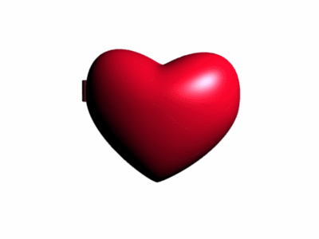

BWSI Autonomous RACECAR Course 2025 -- Team 2

Team Members: Annabeth Pan, Angela Zhao, Dinesh Babu, Roshik Patibandla

All code versions for each challenge will be found under their respective folders. The final versions for each challenge will be formmated as final_(challenge name).py

All files pertaining to the IMU Investigation and machine learning challeneges will be found under their folders.

Please pronouce cone slalom as "Cone Slah-LOHM" or "Cone Slah-LAWM. 

4A: Integration Challenges
* Dot matrix usage
* Telemetry
* Velocity node

4B: Operations (all operations challenges are attempted!)
* Code runs at >=15 FPS
* Code uses <50% CPU on idle
* Code has a state machine with >=5 states
* Code uses >=2 sensors

